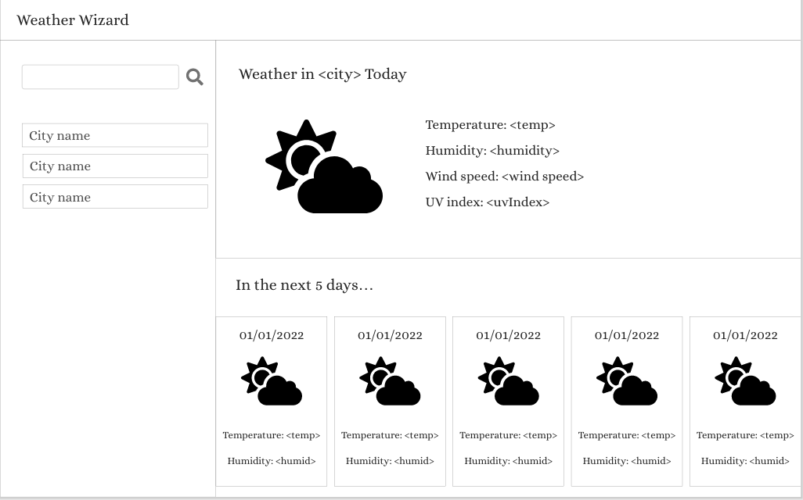

# Weather Forecasting Website

## Project Link

You can view this project on GitHub pages by clicking [here](https://dominikacookies.github.io/weather_forecast_app/)

## Description

This project allows a user to check the current and forecasted weather conditions for a city of their choice.

### Key functionalities
- user is able to view current weather and 5 day forecast for a city of their choice
- user can easily identify the severity of the UV index for the current day as it is colour coded (green/orange/red)
- user's past city searches are stored and displayed on the page
- user can easily access the weather forecast for any of their past searched by clicking on the city name as displayed above
- if user searches for the same city twice, the previouse search is deleted from memory and the new one is added
- if user submits the search form without an input an error message displays
- if user inputs invalid city name into search form an error message displays

## Screenshots of App

### Page when first loaded (no searched conducted)

### Page after first search

### Page on load (following couple of searches in previous session)

### Error message if user enters unrecognised city name

